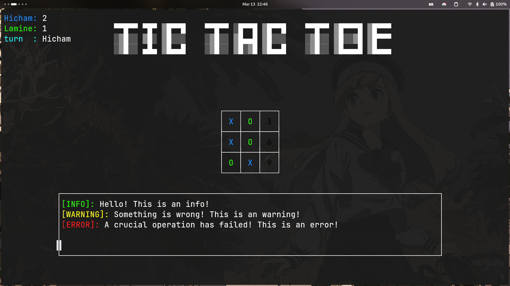

# ❌ CrossToe ⭕
A tic tac toe game written from scratch in Rust

## Features
- A simple logger written from scratch capable of printing info, warnings, and errors.
- Score system.
- Different colors for the two players.

## Keybindings
- Press '1' to '9' to mark a cell and start playing.
- Press 'q' to quit the game.

## Installation
Coming soon (either to cargo crates or to the github releases).

## Todo
- [ ] Only rendering the shapes that need to be updated.
- [ ] Making the interface adaptive to the size of the terminal.
- [ ] Writing an ascii generator from scratch?

## Why tho?
I've implemented this mainly for learning purposes.

## Credits
- [Crossterm](https://github.com/crossterm-rs/crossterm) for cross platform tui apps in rust.
